# Database File Manager (BD2)

**Curso:** Base de Datos 2  
**Institución:** Universidad de Ingeniería y Tecnología (UTEC)  
**Integrantes:**
- Sebastian Romero Pahuara
- Jorge Sebastian Tenorio Romero
- Paris Lenard Herrera Torres
- Llorent Eloy Nunayalle Brañes
- Carlos Alberto Villegas Arce

---

## 1. Introducción y Objetivo
El objetivo principal de este proyecto es implementar un sistema gestor de almacenamiento en memoria secundaria simulado completamente desde cero utilizando Python. No se utilizan motores de bases de datos relacionales ni librerías de persistencia externas, garantizando que toda entrada y salida (E/S) de datos esté controlada explícitamente y empaquetada en bloques fijos de disco (paginación).

Para interactuar con el sistema, se ha desarrollado un **Parser y Lexer SQL propio** que procesa sentencias de consulta. A través de este, el sistema evalúa empíricamente la eficiencia de cuatro técnicas de indexación fundamentales:
-   **Archivo Secuencial (Sequential File):** Para el almacenamiento estructurado de registros contiguos, combinando un archivo principal ordenado y un archivo auxiliar.
-   **Hash Extensible (Extendible Hashing):** Para la indexación dinámica y búsquedas exactas (*point queries*) en tiempo constante $O(1)$, basado en una tabla de directorios y *buckets* que se dividen según su profundidad global y local.
-   **Árbol B+ (B+ Tree):** Para soportar búsquedas eficientes por rangos (*range queries*), manteniendo un árbol balanceado con punteros enlazados a nivel de nodos hoja.
-   **Índice Espacial (R-Tree):** Para la indexación de coordenadas y polígonos, que brinda soporte a consultas espaciales nativas como K-Nearest Neighbors (KNN) y búsquedas geográficas por radio.

El sistema también cuenta con un simulador de **Gestor de Transacciones Concurrente (Isolation Manager)** manejado por *locks* a nivel de registro para prevenir colisiones asíncronas. El propósito final del informe es contrastar el rendimiento teórico (Notación Big O) frente a los resultados prácticos, midiendo el conteo exacto de accesos a páginas físicas en disco (*disk reads/writes*) y los tiempos reales de ejecución.

---

## 2. Descripción de Técnicas y Algoritmos Implementados

### 2.1. Archivo Secuencial (Sequential File)
Esta técnica organiza los registros físicamente en el disco basándose en un atributo clave de ordenamiento.

- **Estructura Físico-Lógica:** Se implementa utilizando un Archivo Principal (Main File) con los registros ordenados y un Archivo Auxiliar (Aux File) para agilizar las inserciones antes de un proceso de reconstrucción (rebuild).
- **Algoritmo de Inserción:** Se realiza una inserción sobre el archivo auxiliar, leyendo la última página. Si el tamaño *k* del archivo auxiliar es mayor o igual a $\sqrt{n}$, donde *n* es el tamaño del archivo, se procede a realizar una reconstrucción fusionando el archivo principal y con el auxiliar. 
- **Algoritmo de Búsqueda:** Se hace una búsqueda binaria a nivel de páginas dentro del archivo principal y recorrido lineal en las páginas del archivo auxiliar.
- **Algoritmo de Búsqueda por Rango:** Se aprovecha el orden en el archivo principal para realizar una búsqueda binaria con la llave inicial. Una vez encontrado el inicio, empieza a recorrer ordenadamente el resto del archivo principal y secuencialmente el auxiliar para encontrar el último registro dentro del rango especificado.
- **Algoritmo de Eliminación:** Se busca al registro a eliminar mediante una búsqueda binaria sobre el archivo principal y sobre una búsqueda lineal sobre el archivo auxiliar. Una vez encontrado, marca al registro como eliminado y no se tiene encuenta para futuras consultas. Este se elimina una vez se llama a la reconstrucción del archivo.
- **Algoritmo de Inserción Masiva:** Se toma el CSV de entrada y se convierte en el archivo principal ordenado. Esto se logra a partir de cargar los registros en un bloques pequeños de RAM, ordenar el bloque y guardarlo como archivo binario para después hacer la mezcla de los archivos temporales y empaquetarlos en páginas del tamaño expecíficado. Todo esto se hace mediante el algoritmo externo **Two-Phase Multiway Merge Sort** (abreviado External Sort).
- **Algoritmo de Reconstrucción:** Se agarran los bytes del archivo principal y los bytes del auxiliar y los pega todos juntos en un solo archivo temporal, el cual se pasa al External Sort devolviendo un archivo principal completamente ordenado.

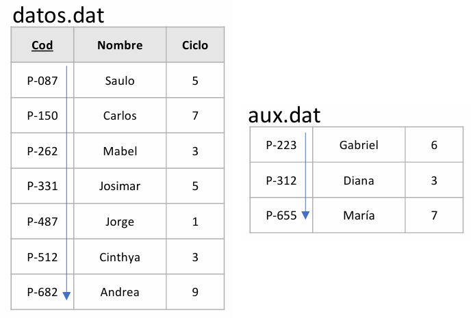

### 2.2. Extendible Hashing
Estructura de indexación dinámica diseñada para realizar búsquedas exactas (*point queries*) en tiempo casi constante.

- **Estructura Físico-Lógica:** Se implementa mediante una tabla de directorios (Directory Table) de tamaño $2^d$ (donde $d$ es la profundidad global) que apunta a *buckets* individuales en el disco. Cada bucket tiene una profundidad local que puede crecer independientemente.
- **Algoritmo de Inserción:** Se calcula el hash de la clave para obtener los primeros $d$ bits, que indexan directamente en el directorio. Si el bucket tiene espacio, se inserta el registro. Si el bucket está lleno, se duplica el bucket (split) y se redistribuyen los registros. Si la profundidad local alcanza la profundidad global, se duplica el directorio completo.
- **Algoritmo de Búsqueda:** Se aplica la función hash a la clave de búsqueda, se utilizan los primeros $d$ bits para indexar en el directorio y se accede directamente al bucket correspondiente. La búsqueda dentro del bucket es lineal.
- **Algoritmo de Eliminación:** Se busca el registro mediante el algoritmo de búsqueda. Una vez encontrado, se marca como eliminado. Si el bucket queda vacío tras sucesivas eliminaciones, puede fusionarse con su buddy bucket (si lo hay) durante operaciones de mantenimiento.
- **Ventajas:** Crecimiento dinámico sin necesidad de reorganización global frecuente. El directorio crece de forma logarítmica respecto al número de registros.
- **Algoritmo de Split:** Cuando un bucket se llena, se duplica su tamaño y se rehashean los registros usando $d_{local} + 1$ bits. Si el directorio también necesita crecer, se duplica su tamaño duplicando todos los punteros.

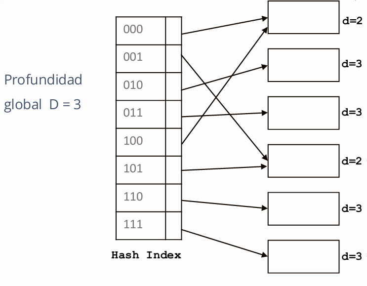

### 2.3. Unclustered B+ Tree
Árbol balanceado diseñado para soportar búsquedas por rango (*range queries*) y acceso ordenado a los datos de forma eficiente.

- **Estructura Físico-Lógica:** Se implementa como un árbol balanceado donde todos los nodos hoja están al mismo nivel y conectados entre sí mediante punteros (linked list). Los nodos internos actúan como índices de navegación, mientras que las hojas contienen los registros reales o punteros a ellos.
- **Algoritmo de Inserción:** Se realiza una búsqueda para localizar la hoja donde debe insertarse la clave. Si la hoja tiene espacio, se inserta directamente. Si la hoja está llena, se divide en dos nodos y la clave media se propaga al nodo padre. Este proceso puede causar divisiones en cascada hasta alcanzar la raíz.
- **Algoritmo de Búsqueda Puntual:** Se comienza desde la raíz y se navega descendentemente comparando la clave con los valores de separación en cada nodo interno. Una vez alcanzada la hoja, se busca linealmente el registro.
- **Algoritmo de Búsqueda por Rango:** Se localiza la hoja que contiene el límite inferior del rango. Luego, se recorren las hojas de forma secuencial (siguiendo los punteros enlazados) hasta encontrar el límite superior, recolectando todos los registros en el rango.
- **Algoritmo de Eliminación:** Se localiza el registro mediante búsqueda. Se elimina de la hoja. Si la hoja queda por debajo del mínimo número de entradas permitidas (*underflow*), se fusiona con una hoja hermana o se redistribuyen las entradas. Este proceso puede propagarse hacia arriba hasta la raíz.
- **Orden del Árbol:** El número de entradas por nodo se determina basándose en el tamaño de página (PAGE_SIZE) y el tamaño de las claves, permitiendo múltiples entradas por página para minimizar accesos a disco.
- **Balanceo Garantizado:** Todos los nodos hoja están al mismo nivel, garantizando que cualquier búsqueda realiza el mismo número de accesos a disco en el peor caso.

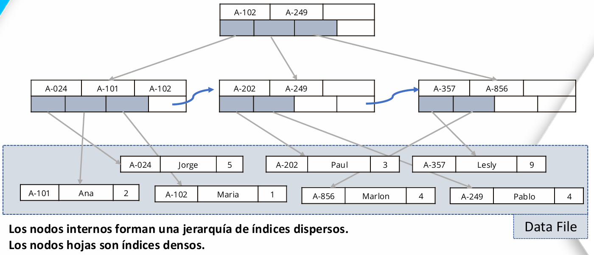

### 2.4. Índice Espacial (R-Tree)
Estructura de árbol diseñada para indexar información multidimensional. Utilizada para procesar los datos de ubicaciones geográficas (*Pickup_Location* / *Dropoff_Location*).

- **Estructura Físico-Lógica:** Nodos agrupados en páginas del disco como Minimum Bounding Boxes (MBBs).
- **Algoritmo de Inserción / Construcción:** Para preservar la eficiencia y lograr la menor cantidad de solapamientos en una carga masiva de los datos, se investigó e implementó el algoritmo **Sort-Tile Recursive (STR)** para la carga de los datos en primera instancia. El algoritmo construye el árbol "de abajo hacia arriba" a partir de un conjunto de datos estático, dividiéndolos en tiles rectangulares mediante un ordenamiento multidimensional recursivo. Esto maximiza el factor de llenado de los nodos y minimiza el área de los rectángulos envolventes (MBB), lo que lleva a una reducción drástica del tiempo de respuesta para operaciones de KNN y RangeSearch al reducir el número de ramas a explorar. 

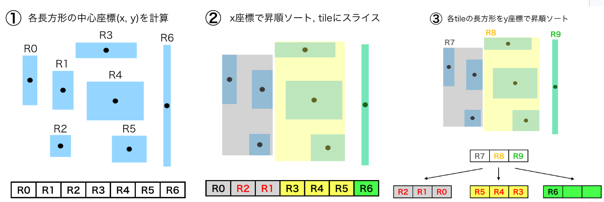

- **Algoritmo de Búsqueda de Vecinos Más Cercanos (KNN):** Este algoritmo implementa una estrategia de búsqueda tipo "Best-First" utilizando una cola de prioridad (*Min-Heap*) para encontrar los k objetos más cercanos a un punto de referencia. El proceso comienza en la raíz y prioriza la exploración de los nodos cuyos Rectángulos Envolventes Mínimos (MBR) tienen la menor distancia al objetivo (función *min_dist*). Al extraer elementos de la cola, si se encuentra un nodo interno, se calculan las distancias a sus hijos y se insertan nuevamente en la prioridad; si se llega a un punto real, este se añade directamente al resultado por ser el más cercano disponible en ese momento. Esta técnica optimiza el rendimiento al evitar la inspección de ramas del árbol que están garantizadas a estar más lejos que los candidatos ya encontrados.

- **Algoritmo de Búsqueda por Rango (Query, Radio):** La búsqueda por rango se encarga de localizar todos los elementos que se encuentran dentro de un radio específico alrededor de un punto central, funcionando esencialmente como un filtro de intersección espacial. El algoritmo realiza un recorrido donde se descartan niveles enteros del árbol si su MBR no intersecta el área de búsqueda definida por el radio. Solo cuando un nodo intermedio "toca" el círculo de consulta se exploran sus descendientes, y al llegar a las hojas, se realiza una validación final de la distancia exacta del punto para asegurar que cumple con el criterio de cercanía antes de recuperar su información del almacenamiento.

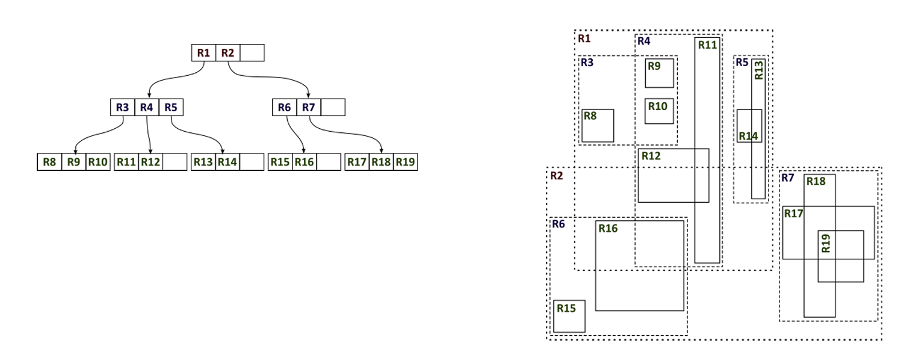

### 2.5 Algoritmos Externos

#### 2.5.1 Two-Phase Multiway Merge Sort

Como se mencionó previamente, este algoritmo soluciona el problema de ordenar grandes volúmenes de datos con RAM limitada mediante una primera fase de generación de "runs" ordenados internamente y una segunda fase de mezcla (merging) que utiliza un heap de mínimos para producir la relación final. Este algoritmo fue principalmente usado en la carga masiva de datos para el Sequential File (debido a que la naturaleza de la tarea involucra meter grandes volúmenes de datos dentro de un archivo ordenado) y para la operación añadida `ORDER BY`, el cual resulta sumamente útil ante búsquedas por rango con un gran volumen de retorno.

#### 2.5.2 External Hashing

Este método se implementó para procesar la nueva operación `GROUP BY` particionando los datos en disco mediante una función hash para luego cargar cada partición individualmente en memoria y construir tablas hash que permitan realizar la agrupación o unión de tuplas de manera eficiente. 

#### 2.5.3 Heap File

Este método se implementó en dos formas, siendo una versión adaptada para el manejo propio del *B+ Tree* y otra versión adaptada para el soporte de operaciones sobre datasets no indexados, funcionando como un Baseline que funciona como un "índice" *Append-only*.

---

## 3. Análisis Teórico Comparativo de Accesos a Disco
En base a la teoría y tamaño de página constante establecido (ej. 4 KB):

| Operación | Sequential File (Teórico) | R-Tree (Teórico) |
| :--- | :---: | :---: |
| **Búsqueda Puntual** | $O(\log_2 b)$ main + aux | $O(\log_m n)$ |
| **Búsqueda x Rango** | $O(\log_2 b + \frac{k}{r})$ | $O(\log_m n + C)$ |
| **Inserción** | $O(1)$ (en Aux log) | $O(\log_m n)$ o Split |

*Donde:* $n$ es la cantidad de registros poblados, $b$ es la cantidad de bloques en disco, $m$ constante de partición del árbol.  

### Explicación Teórica de las Complejidades de Acceso a Disco

A continuación, se detalla la justificación teórica de las complejidades presentadas en la tabla, asumiendo un modelo de costos basado en la cantidad de páginas físicas transferidas entre el disco duro y la memoria RAM.

#### 1. Archivo Secuencial (Sequential File)
La arquitectura de esta técnica se divide en un archivo principal ordenado y un archivo auxiliar desordenado para desbordamientos temporales.
* **Búsqueda Puntual — O(log_2 b) main + aux:** Dado que el archivo principal (main) mantiene un orden físico secuencial, el motor de base de datos puede aplicar una búsqueda binaria a nivel de bloques. Esto garantiza encontrar la página deseada en log_2 b lecturas. Si el registro se insertó recientemente y no está en el archivo principal, se suma el costo de escanear el archivo auxiliar.
* **Búsqueda por Rango — O(log_2 b + k/r):** Inicia con una búsqueda binaria O(log_2 b) para localizar el primer bloque donde comienza la condición del rango. A partir de ese punto, aprovecha el orden físico del disco para leer secuencialmente. El término k/r es el costo de recuperación secuencial, donde 'k' representa la cantidad de registros que cumplen la condición y 'r' es el *blocking factor* (cuántos registros caben en una página).
* **Inserción — O(1) (en Aux log):** Para evitar el costo prohibitivo de desplazar bytes en el archivo principal ordenado, las nuevas inserciones operan como un simple *append* (agregar al final) en el archivo auxiliar. Esto requiere un único acceso de escritura, garantizando tiempo constante.

#### 2. R-Tree (Estructura Jerárquica Multidimensional)
Las estructuras de indexación en árbol balanceadas basan su costo en la profundidad de navegación (altura del árbol).
* **Búsqueda Puntual — O(log_m n):** La complejidad está directamente definida por la altura del árbol. El motor debe descender desde el nodo raíz hasta llegar al nodo hoja correcto (o Minimum Bounding Box aplicable). Cada salto de nivel implica leer una página de disco. La base del logaritmo 'm' (*fanout*) reduce drásticamente la altura del árbol, manteniendo los accesos muy bajos incluso con millones de datos (n).
* **Búsqueda por Rango / Espacial — O(log_m n + C):** Requiere el mismo descenso inicial O(log_m n) para encontrar el límite inicial del rango o el área de interés. El término 'C' representa las lecturas extra necesarias para recorrer las hojas adyacentes o las cajas espaciales solapadas que contienen el resto de los resultados de la consulta.
* **Inserción — O(log_m n) o Split:** El sistema invierte log_m n lecturas para descender hasta la página hoja que debe contener el nuevo registro y realiza la escritura. Si esa página ya alcanzó su límite de capacidad máxima, se desencadena un *Split* (división del nodo). Este fenómeno requiere escribir una nueva página en el disco duro y propagar la actualización de punteros hacia arriba, lo que suma accesos físicos adicionales en ese instante específico.

---

## 4. Control de Concurrencia (Isolation Manager)

Para garantizar la propiedad de **Aislamiento (Isolation)** dentro del estándar ACID, el sistema incorpora un **Gestor de Transacciones** robusto que permite el procesamiento de múltiples hilos simultáneos sin comprometer la integridad de los datos.

- **Mecanismo de Bloqueo:** Se implementó una estrategia de **Bloqueo a nivel de registro (Record-level Locking)**. En lugar de bloquear archivos o tablas completas, el `TransactionManager` gestiona un diccionario dinámico de bloqueos (`record_locks`) donde cada registro (identificado por su clave primaria) posee su propio semáforo de exclusión mutua (`threading.Lock`).
- **Prevención de Deadlocks (Espera-Cautelosa):** Con el fin de evitar interbloqueos infinitos, el motor utiliza una técnica de **Espera-Cautelosa (Wait-Cautious)**. Durante la solicitud de un recurso (`_get_lock`), el sistema verifica si el dueño actual del bloqueo está a su vez esperando por otro recurso; de ser así, la transacción entrante se aborta preventivamente ejecutando un **Rollback** para liberar sus propios recursos y evitar el ciclo de deadlock.
- **Simulación mediante Hilos:** La concurrencia se logra ejecutando transacciones simultáneas a través de hilos independientes (`threading.Thread`). Esto permite que el sistema evalúe en tiempo real la competencia por los recursos del disco y la efectividad del gestor ante cargas de trabajo asíncronas.
- **Protocolo de Dos Fases (2PL):** El gestor sigue un flujo estrictamente controlado donde primero identifica mediante el AST todas las claves necesarias, adquiere los bloqueos (fase de crecimiento) y solo libera los registros en el bloque final de la transacción (fase de decrecimiento), asegurando que las operaciones sean atómicas y aisladas del resto de procesos concurrentes.

---

## 5. Descripción del Parser SQL
Para poder interactuar con las estructuras desde sentencias SQL, se desarrolló un Parser y Lexer propio adaptado a las necesidades específicas del motor, particularmente para soportar consultas espaciales nativas:

- **Lexer (Análisis Léxico):** Construido mediante el módulo de expresiones regulares de Python. Actúa como un *autómata finito determinista* (AFD) que escanea la cadena de entrada de izquierda a derecha, tokenizando las palabras clave reservadas (`SELECT`, `CREATE`, `POINT`, `RADIUS`, etc.), identificadores, literales (números y cadenas) y símbolos. Ignora los espacios en blanco y rastrea la posición (línea y columna) para un reporte preciso de errores sintácticos.
- **Parser (Análisis Sintáctico):** Implementado como un analizador sintáctico descendente predictivo (*Top-Down Recursive Descent Parser*). Verifica la secuencia lógica de los tokens asegurando que cumplan con la gramática libre de contexto definida. Traduce directamente las sentencias válidas a un *Árbol de Sintaxis Abstracta* (AST) en formato de diccionario, el cual mapea las acciones a los métodos internos de las estructuras de datos
- **Autómatas / Gramática Principal:**  
La sintaxis del lenguaje soportado se rige por la siguiente gramática libre de contexto donde los elementos entre corchetes `[ ]` denotan opcionalidad:
```
<S>             ::= <CREATE_STMT> | <SELECT_STMT> | <INSERT_STMT> 
                  | <DELETE_STMT> | <DROP_STMT>

<CREATE_STMT>   ::= CREATE TABLE <ID> ( <COL_DEF_LIST> ) [ FROM FILE <STRING> [ DELIMITER <STRING> ] ] ;
<COL_DEF_LIST>  ::= <COL_DEF> | <COL_DEF> , <COL_DEF_LIST>
<COL_DEF>       ::= <ID> <TYPE> [ INDEX <ID> ]
<TYPE>          ::= INT | FLOAT | VARCHAR | POINT | BOOLEAN | DATE

<SELECT_STMT>   ::= SELECT * FROM <ID> <SELECT_OPTS> ;
<SELECT_OPTS>   ::= GROUP BY <ID>
                  | WHERE <ID> <CONDITION> [ ORDER BY <ID> ]
<CONDITION>     ::= = <VALUE>
                  | BETWEEN <NUMBER> AND <NUMBER>
                  | IN ( POINT ( <NUMBER> , <NUMBER> ) , <SPATIAL_PARAM> )
<SPATIAL_PARAM> ::= RADIUS <NUMBER> | K <NUMBER>

<INSERT_STMT>   ::= INSERT INTO <ID> VALUES ( <VALUE_LIST> ) ;
<VALUE_LIST>    ::= <VALUE> | <VALUE> , <VALUE_LIST>

<DELETE_STMT>   ::= DELETE FROM <ID> WHERE <ID> = <VALUE> ;

<DROP_STMT>     ::= DROP TABLE <ID> ;

<VALUE>         ::= <NUMBER> | <STRING>
```

- **Observaciones:** En el presente parser se hacen una serie de simplificaciones respecto a cómo funcionan los Parser SQL realmente. Entre estos cambios están:
- `VARCHAR` denota un tipo de dato String de que asume una **longitud fija** de 50 bytes. No soporta la modificación de la longitud `VARCHAR (<NUMBER>)`.
- `POINT` es un tipo de dato compuesto de 2 datos de tipo `float`. Se simplificó la forma de llegar a este tipo de dato mediante instanciar el tipo `POINT` en la declaración de creación de la tabla (siendo que al declarar este tipo al leer un archivo CSV en la carga de datos, asume que la columna sobre la que se aplica y la siguiente serán las coordenadas espaciales `x,y` compuestas).
- El parser no permite en esta versión un filtro de selección de columnas al realizar una operación de `SELECT`. Siendo obligatorio usar `*` seguido de la palabra reservada.
- El tipo de dato `DATE` se comporta como un `VARCHAR` de longitud máxima de 19 bytes (siguiendo el formato `YYYY-MM-DD HH:mm:ss`). Este cambio dista del tipo de manejo de los motores de base de datos reales, siendo que internamente estos manejan el tamaño del tipo `DATE` mediante 4 bytes (tratándolo de manera parecida a un `INT`).
- Se ha implementado el `GROUP BY` bajo un caso de uso simplificado y directo (`SELECT * FROM <ID> GROUP BY <ID> ;`). En esta versión del parser, la agrupación es mutuamente excluyente con la cláusula `WHERE` y asume implícitamente el conteo (COUNT) de los registros sin requerir declarar funciones de agregación en la proyección del SELECT. Esto se hace para simplificar el parser ya establecido durante las semanas de trabajo.
- El `ORDER BY` opera exclusivamente como un sufijo opcional tras una condición de filtrado (`WHERE`). Su detección en el AST delega el ordenamiento físico al algoritmo de External Merge Sort, lo que garantiza que consultas masivas se ordenen en disco sin riesgo de saturar la memoria RAM.

---

## 5. Resultados Experimentales y Discusión


Tablas:
---

**Tabla 1: Operación de Inserción**
| Técnica | Tamaño (N) | Accesos a Disco (Reads + Writes) | Tiempo de Ejecución (ms) |
| :--- | :---: | :---: | :---: |
| **Sequential File** | 1,000 | 2 | 196.05 |
| | 10,000 | 2 | 227.91 |
| | 100,000 | 2 | 749.85 |
| **B+ Tree** | 1,000 | 3 | 193.37 |
| | 10,000 | 3 | 256.54 |
| | 100,000 | 3 | 781.80 |
| **Extendible Hashing** | 1,000 | 5 | 197.05 |
| | 10,000 | 2 | 302.18 |
| | 100,000 | 2 | 817.00 |

**Tabla 2: Búsqueda Puntual (Point Query)**
| Técnica | Tamaño (N) | Accesos a Disco (Páginas) | Tiempo de Ejecución (ms) |
| :--- | :---: | :---: | :---: |
| **Sequential File** | 1,000 | 1 | 290.61 |
| | 10,000 | 10 | 234.42 |
| | 100,000 | 13 | 736.31 |
| **B+ Tree** | 1,000 | 2 | 195.68 |
| | 10,000 | 2 | 247.56 |
| | 100,000 | 2 | 824.33 |
| **Extendible Hashing** | 1,000 | 1 | 179.18 |
| | 10,000 | 1 | 273.95 |
| | 100,000 | 1 | 766.55 |

**Tabla 3: Búsqueda por Rango (Range Query)**
| Técnica | Tamaño (N) | Accesos a Disco (Páginas) | Tiempo de Ejecución (ms) |
| :--- | :---: | :---: | :---: |
| **Sequential File** | 1,000 | 14 | 237.06 |
| | 10,000 | 19 | 242.98 |
| | 100,000 | 21 | 840.50 |
| **B+ Tree** | 1,000 | 2 | 203.48 |
| | 10,000 | 2 | 246.89 |
| | 100,000 | 2 | 752.56 |

*Nota: El Extendible Hashing no se incluye en esta tabla ya que su arquitectura no soporta búsquedas por rango de forma nativa.*

**Tabla 4: Consultas Espaciales (R-Tree)**
| Operación | Tamaño (N) | Accesos a Disco (Páginas) | Tiempo de Ejecución (ms) |
| :--- | :---: | :---: | :---: |
| **Búsqueda por Radio** | 1,000 | 1,704 | 915.91 |
| | 10,000 | 42,481 | 12,009.56 |
| | 100,000 | 468,296 | 120,193.01 |
| **K-Nearest Neighbors (KNN)**| 1,000 | 84 | 274.20 |
| | 10,000 | 129 | 425.97 |
| | 100,000 | 179 | 1,479.87 |


Graficas
----
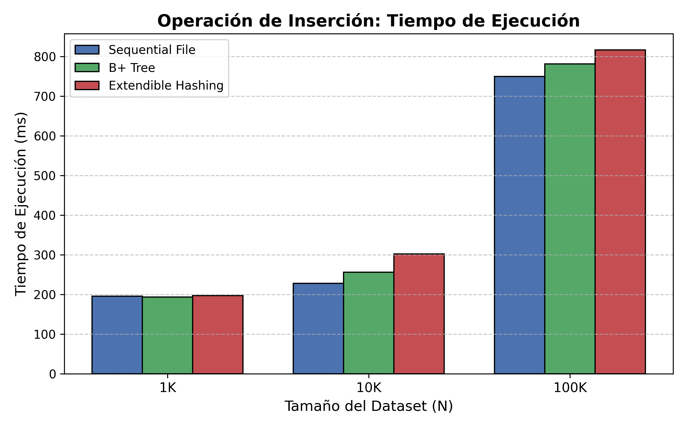
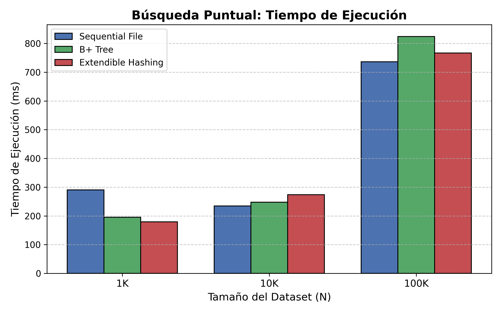
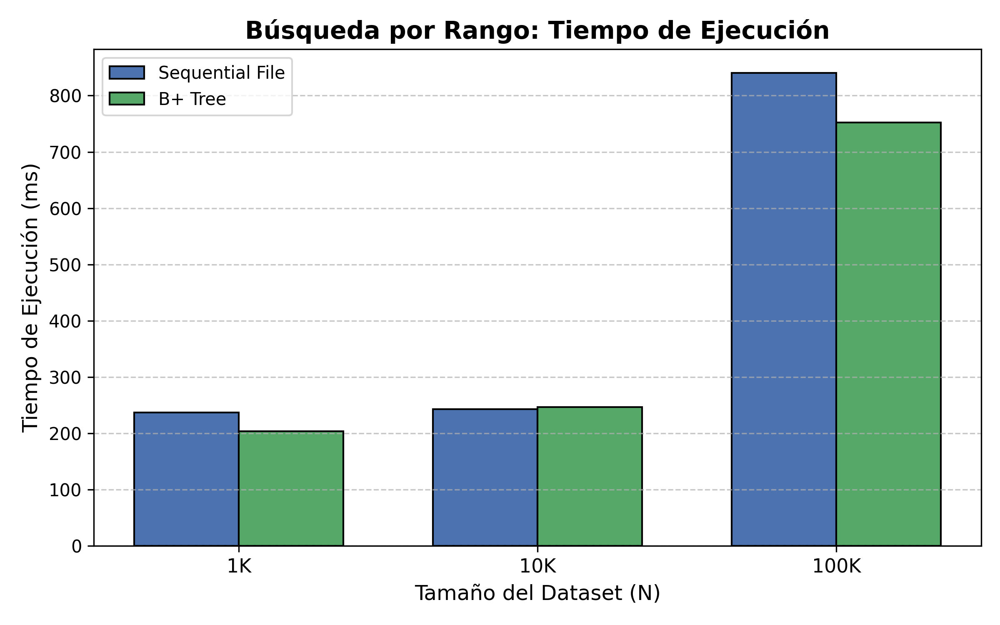
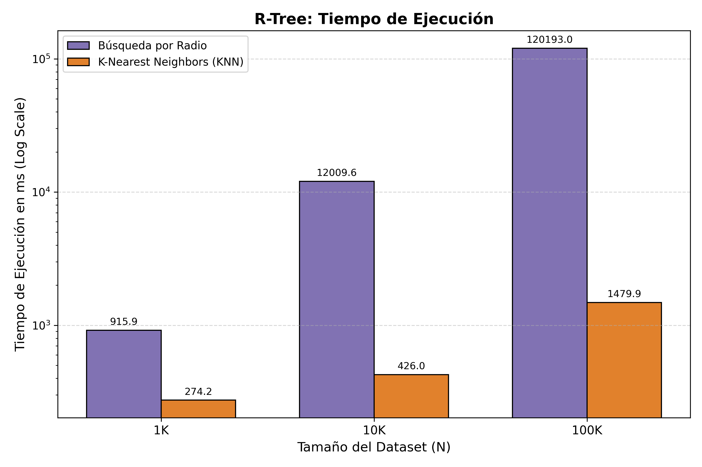


### 6.1. Discusión y Correspondencia Teórica

Al analizar los resultados empíricos frente al tamaño del dataset (N), comprobamos el cumplimiento de la complejidad teórica esperada para cada técnica:

1. **Eficiencia Constante del Extendible Hashing $O(1)$:** Nuestros datos demuestran que, sin importar si el dataset tiene 1,000 o 100,000 registros, la búsqueda puntual en el Hash siempre requirió exactamente **1 acceso a disco**. Esto valida empíricamente su diseño de mapeo directo por directorio. Los picos observados en la inserción (5 accesos en 1K) se deben a los *splits* dinámicos de los buckets.

2. **Crecimiento Logarítmico del B+ Tree $O(\log_m n)$:**
El árbol B+ demostró ser la estructura más estable. Las búsquedas puntuales se mantuvieron fijas en **2 accesos a disco** para todos los tamaños de N. Esto indica que el árbol está perfectamente balanceado y que su altura no superó los 2 niveles incluso con 100K registros, aprovechando eficientemente el *Page Size*.

3. **Degradación del Sequential File:**
Como dicta la teoría, la búsqueda binaria del archivo secuencial $O(\log_2 b)$ se degrada conforme crece el archivo. Observamos que los accesos a disco en búsquedas puntuales subieron progresivamente de 1 (en 1K) a 10 (en 10K) y hasta 13 páginas (en 100K), haciéndolo el método menos eficiente para consultas directas en grandes volúmenes comparado con Hash y B+ Tree.

4. **Escalabilidad del R-Tree (KNN vs Radio):**
El R-Tree arrojó un contraste interesante. La búsqueda de vecinos más cercanos (KNN) escaló de maravilla, pasando de 84 accesos a solo 179 accesos al multiplicar los datos por 100. Sin embargo, la búsqueda por Radio sufrió una explosión combinatoria en 100K (llegando a 468,296 lecturas y 120 segundos). Esto evidencia que con un radio estático muy grande en un área densamente poblada (taxis en NY), el R-Tree se ve forzado a recuperar casi todas las hojas, comportándose como un *Full Scan*.
---

## 7. Interfaz Gráfica (GUI)
*(Colocar capturas de pantalla de la aplicación ejecutándose)*
- **Captura 1:** Pantalla principal y carga (CREATE).
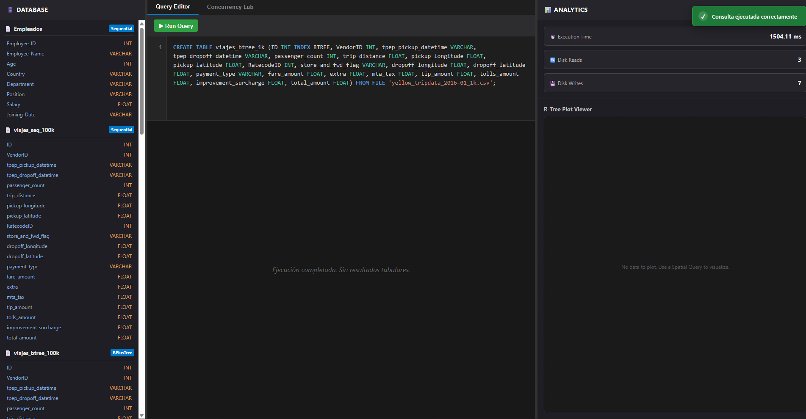
- **Captura 2:** Realizando una búsqueda SELECT y mostrando tabla de resultados y conteo de páginas de disco y tiempo.
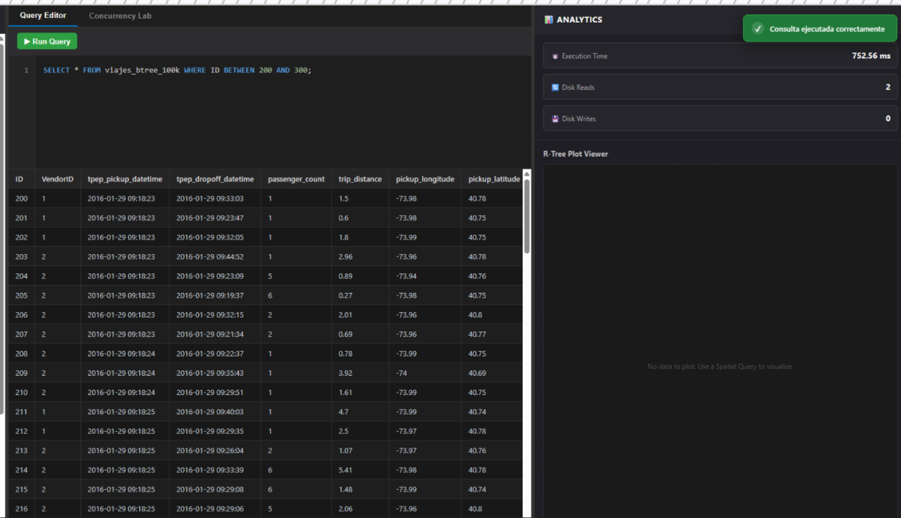
- **Captura 3:** Visualización del plot Geoespacial.
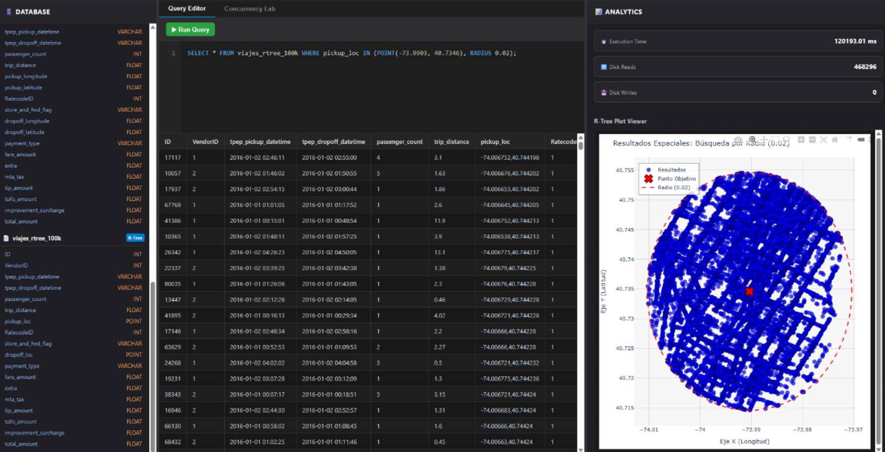

---

## 8. Despliegue y Ejecución
Se ha dockerizado la aplicación para despliegue local.

Requisitos:
- Docker Desktop (daemon corriendo).

Comandos esenciales (desde la raíz):

```bash
docker-compose up --build        # build y levantar (foreground)
docker-compose up -d --build     # levantar en background
docker-compose down              # parar y eliminar contenedores
docker-compose build --no-cache  # reconstruir sin caché
```

Puertos:
- Frontend: http://localhost:5173
- Backend: http://localhost:8000 (Swagger: http://localhost:8000/docs)

Notas rápidas:
- Use `localhost` en el navegador (no `0.0.0.0`).
- Si añade dependencias Python: actualizar `requirements.txt` y ejecutar `docker-compose build --no-cache backend`.
- Si añade dependencias de frontend: ejecutar `npm install` en `frontend/` y reconstruir.

Comandos útiles de depuración:

```bash
docker-compose logs -f backend
docker compose exec backend sh
```

Eso es todo: con estos comandos la aplicación quedará accesible y los datos persistirán en las rutas montadas por volumen.

## 9. Presentación
En el siguiente enlace se adjunta la presentación en vivo del proyecto: https://drive.google.com/file/d/1ySMAgzBts_2pduKfxp41bEeK9-1W9aq1/view?usp=sharing

## 10. Referencias

*   Ramakrishnan, R., & Gehrke, J. (2002). *Database Management Systems* (3rd ed.). McGraw-Hill.
*   Silberschatz, A., Korth, H. F., & Sudarshan, S. (2019). *Database System Concepts* (7th ed.). McGraw-Hill.
*   Leutenegger, S. T., Lopez, M. A., & Edgington, J. (1997). STR: A simple and efficient algorithm for R-tree packing. *Proceedings of the 13th International Conference on Data Engineering*, 497-506. https://ia800709.us.archive.org/13/items/nasa_techdoc_19970016975/19970016975.pdf
